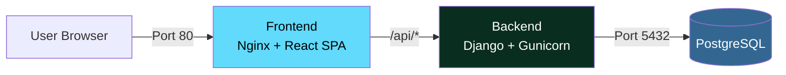

# 🚀 Self-Hosting Guide

Deploy **Imhotep Finance** on your own server in minutes. No source code required — just Docker.

---

## Architecture Overview



| Service | Container Name | Image | Port |
|---------|---------------|-------|------|
| **Frontend** | `imhotep_finance_frontend` | `imhoteptech/imhotep_finance_frontend` | `80` (HTTP) |
| **Backend** | `imhotep_finance_backend` | `imhoteptech/imhotep_finance_backend` | `8000` (API) |
| **Database** | `imhotep_finance_db` | `postgres:16-alpine` | Internal only |

> The frontend nginx container proxies all `/api/` requests to the backend automatically. Users only need to access port **80**.

---

## Prerequisites

- **Docker** (v20.10+) and **Docker Compose** (v2.0+)
- A server with at least **1 GB RAM** and **10 GB disk space**
- Basic terminal/SSH access

Verify your setup:

```bash
docker --version        # Docker version 20.10+
docker compose version  # Docker Compose version v2.0+
```

---

## Quick Start (5 Minutes)

### Step 1 — Create a deployment directory

```bash
mkdir -p imhotep-finance && cd imhotep-finance
```

### Step 2 — Download the production files

Download `docker-compose.prod.yml` and the `.env` template:

```bash
# Download docker-compose.prod.yml
curl -fsSL -o docker-compose.prod.yml \
  https://raw.githubusercontent.com/Imhotep-Tech/imhotep_finance/main/docker-compose.prod.yml

# Download .env template
curl -fsSL -o .env \
  https://raw.githubusercontent.com/Imhotep-Tech/imhotep_finance/main/.env.prod.example
```

<details>
<summary>📥 Using <code>wget</code> instead of <code>curl</code></summary>

```bash
wget -O docker-compose.prod.yml \
  https://raw.githubusercontent.com/Imhotep-Tech/imhotep_finance/main/docker-compose.prod.yml

wget -O .env \
  https://raw.githubusercontent.com/Imhotep-Tech/imhotep_finance/main/.env.prod.example
```

</details>

### Step 3 — Configure your environment

Open `.env` in your favorite editor and update all values marked with `CHANGE_ME`:

```bash
nano .env   # or vim, code, etc.
```

**At minimum, you must change these 3 values:**

| Variable | What to do |
|----------|------------|
| `POSTGRES_PASSWORD` + `DATABASE_PASSWORD` | Set to a strong password (must match) |
| `SECRET_KEY` | Generate: `python3 -c "import secrets; print(secrets.token_urlsafe(50))"` |
| `FIELD_ENCRYPTION_KEY` | Generate: `python3 -c "from cryptography.fernet import Fernet; print(Fernet.generate_key().decode())"` |

> ⚠️ **Don't have Python installed?** You can generate random strings with:
> ```bash
> # SECRET_KEY alternative:
> openssl rand -base64 50
>
> # FIELD_ENCRYPTION_KEY alternative (must be Fernet-compatible):
> # Install Python temporarily or use an online Fernet key generator
> docker run --rm python:3.13-slim python -c "from cryptography.fernet import Fernet; print(Fernet.generate_key().decode())"
> ```

### Step 4 — Start the application

```bash
docker compose -f docker-compose.prod.yml up -d
```

Docker will automatically pull the images and start all three services.

### Step 5 — Verify the deployment

```bash
# Check all services are running
docker compose -f docker-compose.prod.yml ps
```

You should see all three containers with status **Up** or **healthy**:

```
NAME                        STATUS
imhotep_finance_db          Up (healthy)
imhotep_finance_backend     Up (healthy)
imhotep_finance_frontend    Up
```

Access the application:

| URL | Description |
|-----|-------------|
| `http://your-server` | 🌐 Web application |
| `http://your-server/api/` | 🔌 API endpoints |
| `http://your-server/swagger/` | 📖 API documentation |
| `http://your-server/admin/` | ⚙️ Django admin panel |

> 💡 Replace `your-server` with your server's IP address or domain name. If running locally, use `localhost`.

---

## Detailed `.env` Configuration

The `.env` file contains all configuration for the database, backend, and optional integrations. Here's what each section does:

### 🗄️ Database (Required)

```env
# PostgreSQL container settings
POSTGRES_DB=imhotep_finance_db
POSTGRES_USER=imhotep_finance_user
POSTGRES_PASSWORD=your-strong-password     # ← CHANGE THIS

# Django database connection (must match above)
database_type=postgresql
DATABASE_NAME=imhotep_finance_db            # ← must match POSTGRES_DB
DATABASE_USER=imhotep_finance_user          # ← must match POSTGRES_USER
DATABASE_PASSWORD=your-strong-password      # ← must match POSTGRES_PASSWORD
DATABASE_HOST=db                            # ← always "db" (Docker service name)
DATABASE_PORT=5432
```

### 🔐 Security (Required)

```env
DEBUG=False                                 # ← MUST be False for production
SECURE_SSL_REDIRECT=True                    # ← Set to False if running on HTTP without SSL
SECRET_KEY=your-generated-secret-key        # ← generate a unique key
FIELD_ENCRYPTION_KEY=your-generated-key     # ← generate a Fernet key
```

### 🌐 URLs (Required for custom domains)

```env
# Your backend URL
SITE_DOMAIN=http://your-domain.com:8000

# Your frontend URL
frontend_url=http://your-domain.com

# CORS origins (which domains can call the API)
CORS_ALLOWED_ORIGINS=http://your-domain.com
ALLOWED_HOSTS=localhost,127.0.0.1,backend,your-domain.com
```

### 📧 Email (Optional)

Required for password reset and email verification features.

```env
MAIL_USER=your-email@gmail.com
MAIL_PASSWORD=your-gmail-app-password
```

> For Gmail: enable 2-Factor Authentication, then [create an App Password](https://myaccount.google.com/apppasswords).

### 🔑 Google OAuth (Optional)

Required only if you want "Sign in with Google".

```env
GOOGLE_CLIENT_ID=your-client-id
GOOGLE_CLIENT_SECRET=your-client-secret
GOOGLE_REDIRECT_URI=http://your-domain.com:8000/api/auth/google/callback/
```

### 💱 Exchange Rates (Optional)

Required for multi-currency support.

```env
EXCHANGE_API_KEY_PRIMARY=your-api-key
```

> Get a free key at [imhotepexchangeratesapi.pythonanywhere.com](https://www.imhotepexchangeratesapi.pythonanywhere.com/)

---

## Managing Your Deployment

### View logs

```bash
# All services
docker compose -f docker-compose.prod.yml logs -f

# Specific service
docker compose -f docker-compose.prod.yml logs -f backend
docker compose -f docker-compose.prod.yml logs -f frontend
docker compose -f docker-compose.prod.yml logs -f db
```

### Stop the application

```bash
docker compose -f docker-compose.prod.yml down
```

### Restart a specific service

```bash
docker compose -f docker-compose.prod.yml restart backend
```

### Create a Django superuser (admin account)

```bash
docker exec -it imhotep_finance_backend python manage.py createsuperuser
```

---

## Updating to New Releases

When a new version is pushed to the `main` branch, updated Docker images are automatically published. To update:

```bash
cd imhotep-finance   # your deployment directory

# Pull the latest images
docker compose -f docker-compose.prod.yml pull

# Restart with new images (migrations run automatically)
docker compose -f docker-compose.prod.yml up -d
```

> 💡 Your data is safe — the PostgreSQL data is stored in a Docker volume (`postgres_data`) that persists across updates.

---

## Backup & Restore

### Backup your database

```bash
docker exec imhotep_finance_db \
  pg_dump -U imhotep_finance_user imhotep_finance_db \
  > backup_$(date +%Y%m%d_%H%M%S).sql
```

### Restore from a backup

```bash
# Stop the backend first
docker compose -f docker-compose.prod.yml stop backend

# Restore
cat backup_20250101_120000.sql | docker exec -i imhotep_finance_db \
  psql -U imhotep_finance_user imhotep_finance_db

# Restart the backend
docker compose -f docker-compose.prod.yml start backend
```

### Backup the entire data volume

```bash
docker run --rm \
  -v imhotep-finance_postgres_data:/data \
  -v $(pwd):/backup \
  alpine tar czf /backup/postgres_volume_backup.tar.gz -C /data .
```

---

## Setting Up HTTPS (Recommended)

For production deployments, you should put a reverse proxy with SSL in front. Here are two popular options:

### Option A: Caddy (easiest — automatic HTTPS)

Create a `Caddyfile`:

```
your-domain.com {
    reverse_proxy localhost:80
}
```

Run Caddy:

```bash
docker run -d --name caddy \
  --network host \
  -v $PWD/Caddyfile:/etc/caddy/Caddyfile \
  -v caddy_data:/data \
  caddy:latest
```

> Caddy automatically obtains and renews Let's Encrypt certificates.

### Option B: Nginx with Let's Encrypt

Use [nginx-proxy](https://github.com/nginx-proxy/nginx-proxy) with [acme-companion](https://github.com/nginx-proxy/acme-companion) for automatic SSL.

### After enabling HTTPS

Update your `.env`:

```env
SITE_DOMAIN=https://your-domain.com
frontend_url=https://your-domain.com
CORS_ALLOWED_ORIGINS=https://your-domain.com
```

Then restart:

```bash
docker compose -f docker-compose.prod.yml restart backend
```

---

## Troubleshooting

### 🔒 Local testing redirects to HTTPS or fails to load

**Symptom**: Accessing `http://localhost` or your server's IP immediately redirects to `https://...` and fails with a connection error.

**Fix**: By default, production security settings redirect all HTTP traffic to HTTPS. If you are running locally or on a server without SSL (on HTTP), add the following setting to your `.env` file:

```env
SECURE_SSL_REDIRECT=False
```

Then recreate the containers:
```bash
docker compose -f docker-compose.prod.yml up -d
```

### Backend cannot connect to database

**Symptom**: Backend logs show `OperationalError: could not connect to server`

**Fix**: Verify your `.env` values match:
- `DATABASE_NAME` must equal `POSTGRES_DB`
- `DATABASE_USER` must equal `POSTGRES_USER`
- `DATABASE_PASSWORD` must equal `POSTGRES_PASSWORD`
- `DATABASE_HOST` must be `db` (the Docker service name)

```bash
# Check database is healthy
docker compose -f docker-compose.prod.yml exec db pg_isready -U imhotep_finance_user
```

### App starts but crashes on missing secrets

**Symptom**: `KeyError: 'SECRET_KEY'` or `KeyError: 'FIELD_ENCRYPTION_KEY'`

**Fix**: Ensure your `.env` file is in the **same directory** as `docker-compose.prod.yml` and contains valid values for `SECRET_KEY` and `FIELD_ENCRYPTION_KEY`.

### Frontend shows a blank page

**Symptom**: Browser shows a white screen, console shows 404 errors

**Fix**: This usually means the frontend container isn't running or the nginx config failed to load.

```bash
# Check frontend container logs
docker compose -f docker-compose.prod.yml logs frontend

# Verify the container is running
docker compose -f docker-compose.prod.yml ps frontend
```

### API calls return 502 Bad Gateway

**Symptom**: The frontend loads but API calls fail with 502

**Fix**: The backend container may not be ready yet. Wait 30 seconds and try again, or check backend logs:

```bash
docker compose -f docker-compose.prod.yml logs -f backend
```

### Port 80 is already in use

**Symptom**: `Error: bind: address already in use`

**Fix**: Change the frontend port in `docker-compose.prod.yml`:

```yaml
  frontend:
    ports:
      - "3000:80"  # Changed from "80:80" to "3000:80"
```

Then access the app at `http://your-server:3000`.

### How to reset everything

```bash
# Stop and remove all containers + volumes (THIS DELETES ALL DATA)
docker compose -f docker-compose.prod.yml down -v

# Start fresh
docker compose -f docker-compose.prod.yml up -d
```

---

## Your deployment directory should look like this

```
imhotep-finance/
├── docker-compose.prod.yml    # Downloaded from GitHub
└── .env                       # Your configured environment
```

That's it — just two files. The Docker images contain everything else.

---

**🎉 You are now running a fully self-hosted Imhotep Finance deployment!**

Questions or issues? [Open an issue on GitHub](https://github.com/Imhotep-Tech/imhotep_finance/issues) or email **imhoteptech@outlook.com**.
